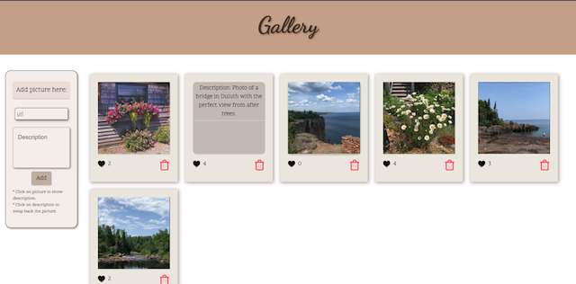
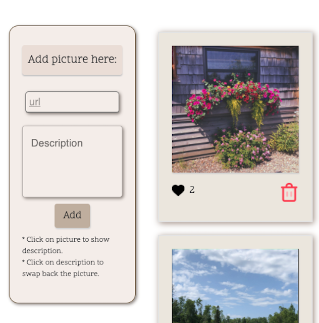

# React-gallery

## Description

Your project description goes here. What problem did you solve? How did you solve it?
* : problem
- : how I solve it

*  Retrieve (`GET`) data from to `/gallery` and store it in `App.js`.
    -  First, I go to the file `gallery.data.js` in the modules folder to save my pictures of the data in the server. 
    -  Then I go to the `App.js` file to show my pictures with tag pair .
    -  And to get my picture data. I have to create a GET request inside the component class to get my picture data from the server. Beside send the GET request, I also create a state object to save/store my data which I will pull from the server over.

* Passing the gallery data stored in `App` via `props` to the `GalleryList` component.
    - To do this, I create a component name `GalleryList`. Using import and export to connect component App with component GalleryList.
    - Then I pass `galleryItems` from the app to GalleryList via `props`.

* Display all of the images on the screen.
    - To display pictures, I use .map() to loop through the galleryItems array then append all of them from GalleryList`file.

* Use new child component to store the individual gallery
    - I create a file named `GalleryItem.js`. Then I also will connect them by import and export. 

* Swap the image with the description on click.
    - To do this, I will use Conditional Rendering. I create a function `handleClickPicture` in the `GalleryItem.js` file to when the user clicks on each picture; it's description will show up. And opersite when the user click on the description it will swap back to the picture.

* Like button on click
    - I make it the same way with the description.

* When the like button is clicked, use `Axios` to update (`PUT`) the like count `/gallery/like/:id`. Update the gallery each time a like button is clicked.
    - In file App.js, I will create a function to update like data. Then I do the condition to when the button is clicked, the like data will have been updated.

* Create a database table 
    - I use Postico to create my database table.

* Add a new component to the user can add new pictures
    - To do this, I create a new component name GalleryForm.js to create a form for the user can input the new picture. 
    - In the form, I have an input field and a button.
    -After setup the form. In the `App.js` file, I create functions take data from the input field send it to the server and from server send it to the database. 
    - I create a `pool.js` file to setup connecting server with my database. Then I create GET, POST, PUT route in `gallery.router.js` to get data, send data, and update data between database and server.

* Ability to delete a gallery item
    - First, I create a delete button for each of the pictures in `galleryItem.js`
    -  Then I also have to setup the DELETE route in `gallery.router.js to remove the image from the database.
    - To delete the item from the client-side, I create a handle delete function to delete.
    - I use SweetAlet to have a sweet alert confirm for the delete button. 

* Get description data.
    - First, I create an input field for description in `GalleryForm.js` file.
    - Then I change some code in sever router to the user be able to post an array input which is picture and description.

## Screen Shot

## Installation
1. Create a database named your database name,
2. The queries in the tables.sql file are set up to create all the necessary tables and populate the needed data to allow the application to run correctly. The project is built on Postgres, so you will need to make sure to have that installed. We recommend using Postico to run those queries as that was used to create the queries,
3. Open up your editor of choice and run an npm install
4. Run npm run server in your terminal
5. Run npm run client in your terminal
6. The npm run client command will open up a new browser tab for you!

## Built With

HTML, CSS, React, JSON, Node.js, Postico(database), Bootstrap, Material-UI, SweetAlert2

## Acknowledgement

Thanks to Prime Digital Academy who equipped and helped me to make this application a reality. 

## Support

If you have suggestions or issues, please email me at thuvu0411@gmail.com

